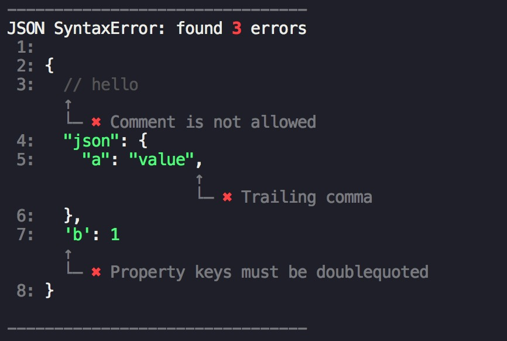

# jsonlint

[](https://github.com/fengzilong/@biu/jsonlint/actions)

lint your json, report all errors at once



# Installation

For NPM users

```bash
npm i @biu/jsonlint
```

for yarn users

```bash
yarn add @biu/jsonlint
```

# API

```js
const { lint } = require( '@biu/jsonlint' )

lint( string, options )
```

### string

Type: `String`

json string

### options.reporter

Type: `String`

Default: `'pretty'`

Values: `'pretty' | 'json'`

### options.silent

Type: `Boolean`

Default: `false`

By default it will log all errors to your console when using `pretty` reporter, if you want to disable this behavior, set `silent` to `true`

### options.allowComments

By default it will report comment errors(in standard json syntax, comments is not allowed), if you want comment errors to be ignored, set `allowComments` to `true`


# Why not try/catch + JSON.parse

`JSON.parse` is not error 

# License

MIT
