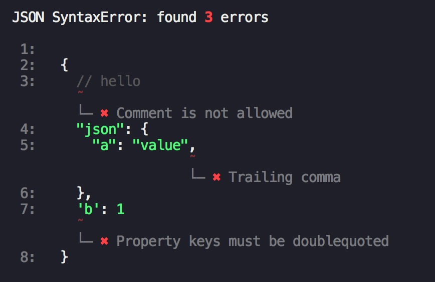

# jsonlint

[](https://github.com/fengzilong/jsonlint/actions)

[](https://www.npmjs.com/package/@biu/jsonlint)

## Screenshot



## Features

- ⚔️ Lint all errors at once
- 🌈 Human-friendly, intuitive message to stdout
- 🚀 Smaller than ESLint

## Installation

For NPM users

```bash
npm i @biu/jsonlint
```

for yarn users

```bash
yarn add @biu/jsonlint
```

## API

```js
const { lint, format } = require( '@biu/jsonlint' )

const result = lint( string, options )
const prettied = format( result )

console.log( result.codeframe ) // or console.log( prettied )
```

`prettied` looks like [Screenshot](#screenshot)

`result` looks like

```js
{
  source: '', // source code
  errors: [], // with keys: `{ line, column, message, severity }`
  comments: [], // with keys: `{ start: { line, column }, end: { line, column } }`
  codeframe: '', // codeframe with error locations and syntax highlight
}
```

### string

Type: `String`

### options.allowComments

By default it reports all comments as error, if you want to remove comment from errors, set `allowComments` to `true`

## Difference with `try/catch + JSON.parse`

`JSON.parse` is not fault tolerant, so it cann't continue after seeing first error, while this library using a fault tolerant parser to avoid this

## License

MIT
